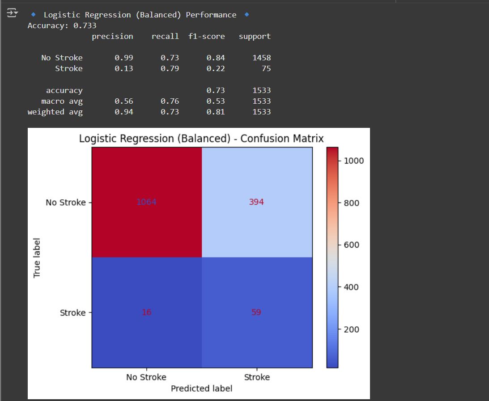

# stroke-prediction-ml

# 🩺 Stroke Prediction with Machine Learning

Binary classification of **Stroke (1)** vs **No Stroke (0)** using the Kaggle *Stroke Prediction* dataset.

## 🎯 Goal
Prioritize **Recall for Stroke** (catch more real stroke cases) using **SMOTE** + **Logistic Regression**.

## 📊 Final (Test) Results
- **Best model:** Logistic Regression (after SMOTE)
- **Accuracy:** ~0.73  
- **Recall (Stroke):** ~0.79  
*(Recall is prioritized due to the risk of missing a stroke case.)*

## 🧱 Method
- Drop `id`, impute missing `bmi` with mean  
- One-hot encode categorical features; z-score scale numeric features  
- Stratified train/test split (70/30)  
- Class imbalance: **SMOTE** on training set only  
- Models compared: Logistic Regression, KNN, Random Forest  
- Metrics: accuracy, precision/recall/F1, confusion matrix  

## 🧠 Artifacts
- Trained model: **models/stroke_model.pkl**  
- Notebook: **notebooks/Stroke_Prediction_ML_Project.ipynb**  
- Plots: **images/**

## 📂 Structure

## 🔗 Dataset
Kaggle — *Stroke Prediction Dataset* (by fedesoriano).
